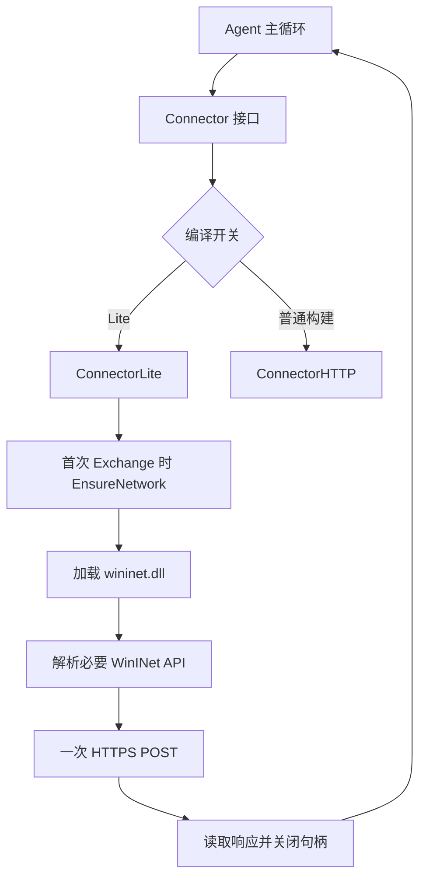
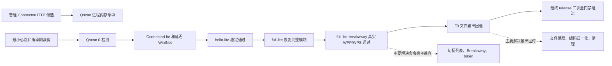

# 卡巴斯基通过点专项分析

本文专门回答一个问题：**这套 WPP/WPS direct_https Agent 是经过哪一步后开始稳定通过卡巴斯基检测的，那一步具体做了什么，为什么它有效？**

本文与完整流程文档配套：

- 全流程入门说明：[END-TO-END-FLOW-BEGINNER.md](LOCAL_CANDIDATE_ROOT/END-TO-END-FLOW-BEGINNER.md)
- 实现总览：[IMPLEMENTATION-OVERVIEW.md](LOCAL_CANDIDATE_ROOT/IMPLEMENTATION-OVERVIEW.md)
- 最终结果：[RESULT.md](LOCAL_CANDIDATE_ROOT/RESULT.md)
- 阶段总记录：[wpp-wps-20260720-stage-summary.md](LOCAL_STAGE_SUMMARY)

## 1. 先给结论

这里有三个容易混在一起的“通过点”，需要分开理解：

| 通过点 | 对应候选 | 代表的意义 |
| --- | --- | --- |
| 最早出现新鲜 Qscan 零检测 | `wpp-wps-agent-stage20-20260720-0040` 一类最小心跳候选 | 证明经过编译期裁剪、最小身份和最小通信路径后，运行中的 Agent 可以通过当前靶机的三层扫描门禁；这个版本的功能面很小。 |
| 第一次“完整模块 + 真实 WPP/WPS 进程 + 三层门禁”同时通过 | `wpp-wps-full-lite-breakaway-20260720-0547` | 这是本次最重要的卡巴通过点：以 `ConnectorLite` 为通信基线，延迟 WinINet 初始化，关闭实验探针和诊断路径；主 WPP/WPS 的 `cmd`/PowerShell 输出仍在继续定位。 |
| 第一次“主 WPP/WPS 全功能 + 三层门禁”同时通过 | `release-wpp-functional-v1` 的 `release-run-2b`、`release-run-3`、`release-run-4` | 在 Lite 通信基线上加入成功的 F0 文件输出回退、PowerShell 输出编码处理、文件 CRUD、disks、上传下载，并完成三次独立新鲜部署。 |

**最关键的判断是：F0 文件输出回退让主 WPP/WPS 的 `cmd` 和 `powershell` 有了稳定结果，但它不是卡巴从检测到通过的根本转折点。** 卡巴通过的运行时基线在 F0 之前已经由 Lite Connector 系列候选建立；F0 主要解决的是“任务如何启动、输出如何回传、临时文件如何清理”。

## 2. 卡巴的三层门禁分别看什么

为了理解结果，先把三种扫描分开：

### 2.1 静态文件扫描

本报告对应的 2026-07-21 历史候选曾经静态扫描 `cache.dat`、`krpt.dll` 和 `krpt.agent.dll`。它关注文件中的字节、结构、导入、字符串和已知静态特征。根据 2026-07-23 的实时模块证据，后续候选只扫描和部署 `cache.dat`、`krpt.dll`。

这份历史候选的三项静态扫描均为：

```text
Processed objects: 1
Total detected:   0
Errors:           0
Return code:      0
```

这个结果说明历史部署包的三个关键文件在单文件检查中均得到 `ok`；后续候选的文件集合会缩减为两个对象。

### 2.2 `Scan_System_Memory`

这个任务扫描系统内存的总体对象，粒度和对象范围与 Qscan 不同。最终版每轮均为：

```text
Processed objects: 1
Total detected:   0
Errors:           0
Return code:      0
```

它适合确认系统内存扫描任务本身的结果，但它不是本轮最有区分度的证据。

### 2.3 新鲜 `Scan_Qscan`

Qscan 扫描范围更大，并且会覆盖运行中的 WPP/WPS 进程对象。它是本轮定位问题时最重要的一层。

早期普通 `ConnectorHTTP` 候选的关键命中出现在 Qscan 对运行中进程内存的检查中，典型名称为：

```text
MEM:Backdoor.Win64.AdaptixC2.gen
```

因此，“单个 DLL 静态扫描为 0”与“运行中的 WPP/WPS 进程通过 Qscan”是两个不同层面的结论。当前工作采用每次等待旧任务释放、重新创建一项 Qscan、记录本轮 `processed/detected/errors/return code` 的方式，避免把历史统计当作当前候选结果。

## 3. 实验时间线

下面这张表把功能范围和卡巴结果放在一起看：

| 时间和候选 | 主要构建状态 | 新鲜 Qscan | 功能范围 | 阶段含义 |
| --- | --- | ---: | --- | --- |
| 2026-07-20 00:40，`stage20` | `CHECKIN_ONLY=1`、`MINIMAL_IDENTITY=1`、`SKIP_UNUSED_API_INIT=1`、`LEARNING_MINIMAL=1`、`HEARTBEAT_ONLY=1` | `3342 / 0 / 0` | 最小心跳/学习链路 | 最早的稳定零检测基线。 |
| 2026-07-20 02:04，`stage31` | 仍是最小心跳构建，切到 `HTTPS_LISTENER` | `3228 / 0 / 0` | 最小 HTTPS 回连 | 说明零检测结果与目标 listener 组合可以复现。 |
| 2026-07-20 03:13，`stage38-lite` | 引入 `ConnectorLite` | `3237 / 0 / 0` | 最小功能 | Lite 通信路径得到独立的零检测证据。 |
| 2026-07-20 03:51，`hello-lite` | Lite 通信路径，保留 hello | `3490 / 0 / 0` | 稳定 hello | 形成用户观察到的“hello 版本稳定上线”基线。 |
| 2026-07-20 04:26，`full-lite` | Lite 通信路径，`learning_minimal=false`、`heartbeat_only=false`、`hello_only=false` | `3494 / 0 / 0` | 完整命令模块 | 证明功能恢复本身仍能保持零检测。 |
| 2026-07-20 05:48，`full-lite-breakaway` | 完整 Lite + WPP Job 句柄列表/Breakaway 兼容 | `3515 / 0 / 0` | 完整模块已编译；真实 WPP/WPS 进程被 Qscan 扫到；主 WPP/WPS 的 cmd/PowerShell 仍记录 `ACCESS_DENIED` | 第一次把“完整模块”和“真实宿主进程 Qscan 零检测”连在一起。 |
| 2026-07-21，`release-wpp-functional-v1` | Lite 基线 + F0 文件输出回退 + PowerShell 编码处理 | `3548/0/0`、`3572/0/0`、`3572/0/0` | 当前 14 项命令面和传输 | 三次独立 release 部署均通过。 |

表中 Qscan 三个数字依次是 `processed / detected / errors`。例如 `3515 / 0 / 0` 表示卡巴处理了 3515 个对象，检测数为 0，错误数为 0。

## 4. 真正的关键步骤：Lite Connector 运行时基线

### 4.1 原版通信路径是什么样

原来的 direct HTTPS agent 主要使用普通 `ConnectorHTTP`。它承担以下工作：

1. 创建 HTTP 函数表。
2. 加载 `wininet.dll`。
3. 解析 WinINet API。
4. 根据 profile 创建 HTTPS 请求。
5. 写入 heartbeat、HTTP 头和任务数据。
6. 读取响应、解密并交给 Agent 主循环。

这个路径功能完整，但构造和初始化阶段包含的状态、函数表、诊断入口和实验探针较多。早期普通 `ConnectorHTTP` 候选的静态文件扫描结果可以通过，而 Qscan 在运行中的 WPS/WPP 内存对象上出现了 `MEM:Backdoor.Win64.AdaptixC2.gen`。这说明当时的主要问题表现为运行时进程对象，而不是简单的单文件命中。

### 4.2 自研 `ConnectorLite` 做了什么

`ConnectorLite` 保留原有 `Connector` 接口，所以 Agent 主循环和 Go/C++ 协议层仍然可以沿用原来的调用方式。它把通信实现压缩成一个较短的实际交换链路：



源码位置：

- `ConnectorLite` 的类定义和延迟网络初始化：[MainAgent.cpp:72](AdaptixServer/extenders/direct_https_agent/src_beacon/beacon/MainAgent.cpp:72)
- 首次网络准备：[MainAgent.cpp:116](AdaptixServer/extenders/direct_https_agent/src_beacon/beacon/MainAgent.cpp:116)
- profile、heartbeat 头和 `Connection: close`：[MainAgent.cpp:166](AdaptixServer/extenders/direct_https_agent/src_beacon/beacon/MainAgent.cpp:166)
- HTTPS 发送、响应读取和句柄回收：[MainAgent.cpp:215](AdaptixServer/extenders/direct_https_agent/src_beacon/beacon/MainAgent.cpp:215)
- 根据编译开关选择 Lite 或普通连接器：[MainAgent.cpp:510](AdaptixServer/extenders/direct_https_agent/src_beacon/beacon/MainAgent.cpp:510)

用更容易理解的话说，Lite Connector 的设计重点是：**把“启动时就准备一堆网络状态”变成“真的要进行第一次通信时再准备网络状态”，同时保留和原 Agent 相同的 Connector 调用契约。**

### 4.3 延迟初始化具体延迟了什么

在 `ConnectorLite` 构造函数中只完成对象本身的初始状态，`wininet.dll`、WinINet 函数指针、Internet 会话句柄和连接句柄都等到第一次发送前准备。

`EnsureNetwork()` 的步骤如下：

1. 通过当前 API 表申请一个小型 `HTTPFUNC` 结构。
2. 调用 `LoadLibraryA` 加载 `wininet.dll`。
3. 解析 `InternetOpenA`、`InternetConnectA`、`HttpOpenRequestA`、`HttpSendRequestA`、`InternetReadFile` 等实际发送所需的函数。
4. 检查关键函数指针齐全后返回成功。
5. 由 `SendData()` 创建 Internet、连接和 request 句柄。
6. 完成一次 HTTPS POST，读取响应后关闭 request、connect、internet 句柄。

最终 release 的 profile 元数据记录了：

```json
{
  "probe_stage": -1,
  "sandbox_probe_stage": -1,
  "memory_loader_diag": false,
  "fast_first_loops": 0,
  "api_hashing": false,
  "lazy_wininet_init": true,
  "lite_connector": true,
  "learning_minimal": false,
  "heartbeat_only": false,
  "hello_only": false,
  "file_commands_only": false
}
```

这些字段的含义是：最终构建保留完整功能，同时把用于定位问题的探针、内存加载诊断和快速首轮循环全部从 release 状态中移出；网络连接使用 Lite 路径，并采用延迟 WinINet 初始化。

### 4.4 为什么采用编译期裁剪

这个项目同时支持实验构建和最终功能构建。Makefile 使用 `DIRECT_HTTPS_*` 宏控制不同模块，链接阶段使用 `-ffunction-sections`、`-fdata-sections` 和 `--gc-sections`，让未被当前配置引用的函数和数据更容易从最终映像中排除。

早期 `stage20` 使用了：

```text
DIRECT_HTTPS_CHECKIN_ONLY=1
DIRECT_HTTPS_MINIMAL_IDENTITY=1
DIRECT_HTTPS_SKIP_UNUSED_API_INIT=1
DIRECT_HTTPS_LEARNING_MINIMAL=1
DIRECT_HTTPS_HEARTBEAT_ONLY=1
```

这类构建的作用是建立一个“小变量、少功能”的干净基线。等基线通过后，再把 `learning_minimal`、`heartbeat_only` 和 `hello_only` 恢复到完整功能状态，观察 Qscan 是否仍为零。

最终 full-lite 构建的关键状态变为：

```text
DIRECT_HTTPS_PROBE_STAGE=-1
DIRECT_HTTPS_SANDBOX_PROBE_STAGE=-1
DIRECT_HTTPS_MEMORY_LOADER_DIAG=0
DIRECT_HTTPS_FAST_FIRST_LOOPS=0
DIRECT_HTTPS_LAZY_WININET_INIT=1
DIRECT_HTTPS_LITE_CONNECTOR=1
DIRECT_HTTPS_NO_API_HASHING=1
DIRECT_HTTPS_LEARNING_MINIMAL=0
DIRECT_HTTPS_FILE_COMMANDS_ONLY=0
DIRECT_HTTPS_HEARTBEAT_ONLY=0
DIRECT_HTTPS_HELLO_ONLY=0
DIRECT_HTTPS_BEAT_DIALECT=2
```

这里的工程价值在于：先用最小版本判断通信基线，再逐步恢复功能；每一步都把功能结果和卡巴结果同时记录。

## 5. 为什么这一步能通过

卡巴斯基的内部检测规则属于黑盒，报告中会给出命中名称和对象范围，但会把具体评分逻辑隐藏起来。因此结论需要分成“直接证据”和“工程推断”。

### 5.1 直接证据

目前有四条直接证据：

1. 普通 `ConnectorHTTP` 候选的典型命中位于运行中 WPP/WPS 进程内存，名称是 `MEM:Backdoor.Win64.AdaptixC2.gen`。
2. `stage20`、`stage31` 等最小构建在新鲜 Qscan 中得到 `detected=0`。
3. `stage38-lite`、`hello-lite`、`full-lite` 和 `full-lite-breakaway` 连续得到新鲜 Qscan 零检测。
4. `full-lite-breakaway` 已经采用完整模块构建，WPP/WPS 进程保持 `Responding`，Qscan 为 `3515 / 0 / 0`；同一候选的 [functional-wpp.json](LOCAL_PRIOR_CANDIDATE_ROOT/functional-wpp.json) 和 [functional-wps-parent.json](LOCAL_PRIOR_CANDIDATE_ROOT/functional-wps-parent.json) 仍记录主宿主 cmd/PowerShell 的 `ACCESS_DENIED`。

因此，最有解释力的转折是：**普通 ConnectorHTTP 运行时基线切换为 Lite Connector，并且以延迟初始化、关闭实验探针、关闭诊断路径的 production 配置运行。**

### 5.2 运行时观察面缩小

AV 对运行中进程的判断通常会综合多个信号：内存映像结构、加载的模块、API 解析和调用序列、线程启动后的行为、网络连接行为、进程创建关系以及多个信号的组合。

本次 Lite 设计带来的变化包括：

- Agent 对象创建阶段少做网络准备。
- WinINet 加载推迟到真正的第一次通信。
- 使用较小的通信状态结构。
- 每次交换只保留必要的 request/connect/internet 句柄，并在完成后关闭。
- final 构建中探针阶段为 `-1`，内存加载诊断为关闭状态。
- 通过编译开关把实验性分支从生产候选中排除。
- 协议数据、profile 字段和 Go/C++ 结果解析保持原有契约，功能恢复集中在命令模块，而不是重新引入完整的实验通信路径。

这些变化共同降低了运行中进程可见的初始化和行为组合。Qscan 的结果从普通 ConnectorHTTP 的进程内存命中转为 Lite 系列持续零检测，说明这个方向与当前靶机的检测规则高度相关。

### 5.3 为什么要把结论归因到组合，而非某一个宏

本轮是分阶段实验，不是一次只改变一个字节的严格统计实验。最小心跳、API 初始化、探针状态、Lite Connector、延迟 WinINet 和完整功能恢复是按阶段推进的。因此，证据支持“Lite/lazy production 基线是关键转折”，而“某一个宏单独造成通过”的结论尚未被单独实验确认。

特别是 `DIRECT_HTTPS_NO_API_HASHING=1`：

- 它让 WinINet API 通过 `GetProcAddress` 和函数名解析，便于代码阅读、问题定位和构建复现。
- 它确实是最终 release 的配置之一。
- 现有阶段数据尚未把“API hashing 开启”和“API hashing 关闭”做成完全相同其他条件下的单变量对照。
- 所以它应被记为构建简化和实验可观测性措施，Lite Connector、延迟初始化和生产探针关闭是更强的归因对象。

同样，`Connection: close`、UA、URI、heartbeat dialect 和 sleep/jitter 会影响网络行为，但当前证据主要指向进程内存 Qscan；这些字段应作为配套稳定性参数记录。

## 6. `full-lite-breakaway` 为什么是最重要的候选

> 本节的静态扫描表格是旧候选的原始记录，保留 `krpt.agent.dll` 是为了让当时的门禁证据与文件清单能够一一对应。它不表示当前构建还会生成这个别名。

`full-lite` 在 04:26 已得到：

```text
cache.dat       static: 1 / 0 / 0 / RC 0
krpt.dll        static: 1 / 0 / 0 / RC 0
krpt.agent.dll  static: 1 / 0 / 0 / RC 0
System Memory   1 / 0 / 0 / RC 0
Qscan           3494 / 0 / 0 / RC 0
```

它证明 Lite 基线与完整模块可以共存。随后 `full-lite-breakaway` 针对 WPS Job 环境继续增加了进程输出兼容路径：

1. 先尝试显式句柄列表，只让子进程继承指定输出句柄。
2. 失败时使用 `CREATE_BREAKAWAY_FROM_JOB` 重试。
3. 再尝试当前宿主 token 的用户级启动路径。
4. 输出任务仍不理想时，进入文件输出后备路径；这一阶段的后备链仍需要 F0 后续修正才能覆盖主 WPP/WPS 的完整输出矩阵。

这轮最终得到：

```text
cache.dat       static: 1 / 0 / 0 / RC 0
krpt.dll        static: 1 / 0 / 0 / RC 0
krpt.agent.dll  static: 1 / 0 / 0 / RC 0
System Memory   1 / 0 / 0 / RC 0
Qscan           3515 / 0 / 0 / RC 0
```

更重要的是，Qscan 原始报告明确扫到了 WPS 安装目录中的 `wpp.exe` 和 `wps.exe`，两项结果均为 `ok`。所以这一轮把“Lite 通信基线通过”与“真实宿主进程通过 Qscan”连在了一起；主宿主命令输出的完整收口留到后面的 F0 release。

完整证据：

- [full-lite-breakaway/RESULT.md](LOCAL_PRIOR_CANDIDATE_ROOT/RESULT.md)
- [full-lite-breakaway/deploy-scan.log](LOCAL_PRIOR_CANDIDATE_ROOT/deploy-scan.log)
- [full-lite-breakaway/kaspersky-qscan.report.txt](LOCAL_PRIOR_CANDIDATE_ROOT/kaspersky-qscan.report.txt)

## 7. F0 文件输出回退做了什么

F0 的触发背景是：主 `wpp.exe` / 主 `wps.exe` 中，普通管道、句柄列表、Breakaway 和 token 组合曾出现 Win32 `ACCESS_DENIED` 或“进程看似启动但 stdout 没有可读内容”的情况；同一 Agent 在插件型 WPS 路径上表现更好。

F0 在命令执行层增加文件后备路径。源码位置：

- 命令启动和回退链：[Commander.cpp:922](AdaptixServer/extenders/direct_https_agent/src_beacon/beacon/Commander.cpp:922)
- 文件输出路径生成：[Commander.cpp:1062](AdaptixServer/extenders/direct_https_agent/src_beacon/beacon/Commander.cpp:1062)
- 重定向命令行构造：[Commander.cpp:1105](AdaptixServer/extenders/direct_https_agent/src_beacon/beacon/Commander.cpp:1105)
- 文件后备任务注册：[Commander.cpp:1509](AdaptixServer/extenders/direct_https_agent/src_beacon/beacon/Commander.cpp:1509)
- 任务完成后的最终读取和清理：[JobsController.cpp:65](AdaptixServer/extenders/direct_https_agent/src_beacon/beacon/JobsController.cpp:65)

它的工作过程可以理解为：

```text
主 WPP/WPS Agent
    |
    | 生成 C:\Users\Public\direct-https-job-<taskId>.out
    v
cmd.exe /d /c "原命令 > 文件 2>&1"
    |
    | JobsController 周期读取文件
    v
打包为原有 COMMAND_JOB 结果
    |
    | 进程退出后再读取一次，回收句柄
    v
删除临时文件，任务结束
```

这里有两个容易忽略的细节：

- `cmd` 复合命令会被整体包裹，保证 `&&` 链中每一行的输出都进入同一个文件。
- PowerShell 输出文件可能是 UTF-16LE，JobsController 读取后会按当前 Agent OEM 代码页做归一化，避免中文和英文标记出现乱码。

F0 的职责是“让主 WPP/WPS 的命令结果可靠回到服务端”，它位于命令执行和 job 生命周期管理层；Lite Connector 位于 HTTPS 通信层。两层解决的问题不同。

## 8. 为什么 F0 没有把卡巴结果带坏

F0 之后，最终 release 继续沿用了已经通过 Qscan 的 Lite 通信基线。新增代码主要集中在：

- `Commander.cpp` 的子进程启动和输出收集。
- `JobsController.cpp` 的文件读取、最终 drain 和临时文件删除。
- `ApiLoader`、`ntdll.h`、`utils` 中为这些调用提供的函数和类型。

网络连接器的关键状态仍保持：

```text
DIRECT_HTTPS_LITE_CONNECTOR=1
DIRECT_HTTPS_LAZY_WININET_INIT=1
DIRECT_HTTPS_PROBE_STAGE=-1
DIRECT_HTTPS_MEMORY_LOADER_DIAG=0
```

所以 F0 扩展了功能层，却保留了已经验证过的通信层运行时基线。最终三次独立部署的 Qscan 结果为：

| 部署 | Qscan processed | detected | errors | 结果 |
| --- | ---: | ---: | ---: | --- |
| `release-run-2b` | 3548 | 0 | 0 | PASS |
| `release-run-3` | 3572 | 0 | 0 | PASS |
| `release-run-4` | 3572 | 0 | 0 | PASS |

证据汇总见 [IMPLEMENTATION-OVERVIEW.md:48](LOCAL_CANDIDATE_ROOT/IMPLEMENTATION-OVERVIEW.md:48) 和 [最终 RESULT.md:88](LOCAL_CANDIDATE_ROOT/RESULT.md:88)。

## 9. 一张图理解整个因果关系



读图时注意：从 `A` 到 `D/E` 是卡巴运行时基线的定位和收敛；从 `G` 到 `H` 是把完整模块放回真实 WPP/WPS 进程并确认 Qscan 零检测；从 `H` 到 `I` 是解决主宿主输出通道；最终三次 release 才完成主 WPP/WPS 全矩阵，并对同一稳定组合做重复部署确认。

## 10. 最终版本的留存信息

最终源码：

- commit：`72e54efee51ee70445344a81c4580142a505b0e2`
- tag：`release-wpp-functional-v1`
- 主源码目录：`LOCAL_ADAPTIXC2_ROOT`

最终制品包：

`LOCAL_CANDIDATE_ROOT/release-wpp-functional-v1`

最终包中的关键文件：

| 文件 | SHA-256 |
| --- | --- |
| `cache.dat` | `5c89811ade759d5c1c6cc25f153357931f66320160da63e77c055c7d2193961b` |
| `krpt.dll` | `b4bb6f1171cb80e9514c767110a3bb68c7e9a3688b9887f423d0fceb1cc46bac` |
| `krpt.agent.dll`（历史副本） | `b4bb6f1171cb80e9514c767110a3bb68c7e9a3688b9887f423d0fceb1cc46bac` |
| `agent_direct_https.so` | `d86807bff5a7e8e7ce146ce3b56b84a2400b42b3973c3d1f56c1973eefaa3779` |
| `direct_https_profile.x64.dll` | `68a869ea61661679b80e7960e0d2ddcbef3c71e0fb9f7d59acbeb01af051860e` |

## 11. 用什么命令复核结论

查看 Lite 和延迟初始化配置：

```bash
rg -n \\
  "DIRECT_HTTPS_(LITE_CONNECTOR|LAZY_WININET_INIT|PROBE_STAGE|MEMORY_LOADER_DIAG)|lite_connector|lazy_wininet" \\
  LOCAL_CANDIDATE_ROOT/release-wpp-functional-v1/profile_dll/build-meta.json \\
  AdaptixServer/extenders/direct_https_agent/src_beacon/beacon/MainAgent.cpp
```

查看首次完整 Lite 候选的 Qscan 统计：

```bash
awk '/Time Start:|Time Finish:|Processed objects:|Total detected:|Errors:/{print}' \\
  LOCAL_PRIOR_CANDIDATE_ROOT/kaspersky-qscan.report.txt
```

查看最终三次 release 的 Qscan 结果：

```bash
rg -n "Qscan|detected|errors|Verdict" \\
  LOCAL_CANDIDATE_ROOT/IMPLEMENTATION-OVERVIEW.md \\
  LOCAL_CANDIDATE_ROOT/release-run-*/RESULT.md
```

查看源码中通信层和命令输出层的边界：

```bash
nl -ba AdaptixServer/extenders/direct_https_agent/src_beacon/beacon/MainAgent.cpp | sed -n '72,325p'
nl -ba AdaptixServer/extenders/direct_https_agent/src_beacon/beacon/Commander.cpp | sed -n '922,1215p'
nl -ba AdaptixServer/extenders/direct_https_agent/src_beacon/beacon/JobsController.cpp | sed -n '26,115p'
```

## 12. 最后用一句话概括

**卡巴斯基真正开始稳定通过的转折，是从普通 `ConnectorHTTP` 运行时基线收敛到 `ConnectorLite + 延迟 WinINet + 生产探针关闭` 的那一阶段；最小心跳候选先证明了零检测方向，`full-lite-breakaway` 首次证明了完整模块和真实 WPP/WPS 进程的 Qscan 零检测可以共存，F0 文件回退随后解决主宿主命令输出问题，最终 release 用三次独立部署把主 WPP/WPS 全功能与这套组合固定下来。**
