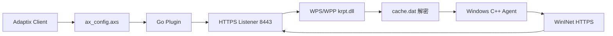
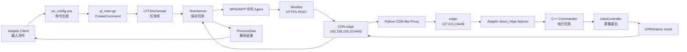
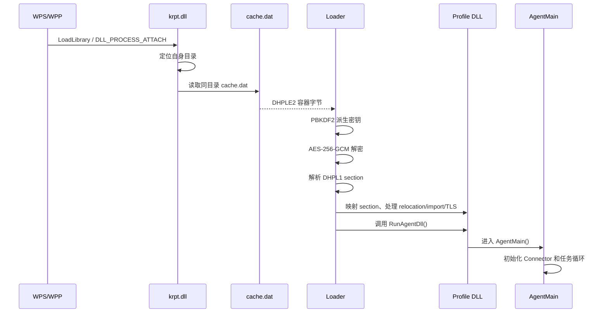

# WPP/WPS direct_https Agent 项目总览与面试问答

> 文档版本：v1.0
> 整理日期：2026-07-24
> 适读对象：刚接触 Windows Agent、Go/C++、协议、WPS 宿主和靶场验证的读者
> 当前候选目录：`/home/chenshuang/CTF/reports/cdn/wpp-wps-cdn-v1-20260724-111809`

本文把本轮 direct_https Agent 项目从源码、协议、构建、加密容器、WPS/WPP 部署、CDN-like 转发、Kaspersky 门禁，到实际功能验证和面试准备串成一条完整主线。

文档中的结论优先级如下：

1. 当前运行状态、端口和真实回连证据。
2. 当前候选的部署文件和构建元数据。
3. 当前源码和协议测试。
4. 已归档的阶段报告和历史实验记录。

为了避免版本混淆，全文使用以下状态标签：

| 标签 | 含义 |
|---|---|
| `[已验证]` | 有源码、日志、哈希或靶机结果支持。 |
| `[当前运行]` | 文档生成时通过只读状态检查观察到。 |
| `[历史实验]` | 用于解释排障过程，属于过去的候选或失败尝试。 |
| `[需补跑]` | 结论已经记录，但构建环境或运行条件仍需要后续复核。 |

---

## 1. 项目一句话介绍

这是一个基于 AdaptixC2 的自研 `direct_https` Windows Agent 项目：在 WPP/WPS 宿主进程中运行 Windows C++ Agent，通过加密 `cache.dat` 装载 profile，使用 WinINet 发起 HTTPS 回连，并在 Teamserver 侧通过 Go 插件完成命令编码、结果解析和功能展示；本轮又增加了本地 Python CDN-like edge/origin 转发和 systemd 自动恢复能力。

用面试中的简短说法，可以表述为：

> 我负责把 AdaptixC2 的 direct_https Agent 从最小 hello 链路逐步恢复到 WPP/WPS 中可持续运行的功能版本，重点解决了 Windows 宿主环境下命令输出、schema4 协议、文件功能、加密 profile 容器、WPS 实际部署、CDN 转发和完整验证证据留存问题。

---

## 2. 项目身份与版本边界

### 2.1 源码和标签

| 项目 | 当前值 |
|---|---|
| 源码仓库 | `/home/chenshuang/CTF/AdaptixC2` |
| 分支 | `feature/direct-https-minimal-agent` |
| 当前源码提交 | `72e54efee51ee70445344a81c4580142a505b0e2` |
| 提交说明 | `feat: restore direct https command output handling` |
| 阶段标签 | `stage-F0-file-fallback`、`stage-F1-command-exec`、`stage-F2-file-crud`、`stage-F3-transfer` |
| 直连基线标签 | `release-wpp-functional-v1` |
| Go/C++ Agent 源码目录 | `/home/chenshuang/CTF/AdaptixC2/AdaptixServer/extenders/direct_https_agent` |

源码工作树仍包含历史 `docs/progress` 文件和其他阶段记录。它们是项目过程留存的一部分，工作树状态本身不足以判断当前候选是否可运行。真正的候选身份由 commit、构建参数、制品哈希、远程部署哈希和运行证据共同确定。

### 2.2 三条需要分开的版本线

| 版本线 | 用途 | listener watermark | `cache.dat` SHA-256 | 状态 |
|---|---|---|---|---|
| 直连 `release-wpp-functional-v1` | 回滚和功能基线，直连 `8443` | 由直连 listener 生成 | 见 direct release `SHA256SUMS` | `[已验证]` |
| 正式 CDN 候选 | 归档的三轮 CDN 候选 | `0cbca9ca` | `0b8a1f17ab9102c67a454a5e8392744b18364783bb17475d97a670a491288826` | `[已验证]` |
| runtime restore 候选 | listener 重建后的当前运行恢复版本 | `89fe0e98` | `9146d7117e18c6d46d2a9cd49fae2f0fdab2765fbd21f5bf8d378f2bc786f58e` | `[当前运行]` |

正式 CDN 候选和 runtime restore 候选的功能代码、`krpt.dll` 和通信结构保持一致；二者的 listener watermark 不同，因此 profile 和 `cache.dat` 必须成对使用。当前运行恢复目录为：

```text
/home/chenshuang/CTF/reports/cdn/wpp-wps-cdn-v1-20260724-111809/evidence/runtime-restore-20260724/
```

### 2.3 当前 CDN 运行参数

| 参数 | 当前值 |
|---|---|
| Windows 靶机 | `192.168.220.131` |
| CDN edge | `192.168.220.10:9443` |
| origin | `127.0.0.1:8448` |
| origin listener | `cdn_wpp_wps_v1_20260724_8448` |
| 逻辑 Host | `cdn-lab.local:9443` |
| HTTP method | `POST` |
| URI | `/api/v1/status`、`/updates/check.php`、`/content.html` |
| heartbeat header | `X-Beacon-Id` |
| sleep | `10s` |
| jitter | `0` |
| connector | lite WinINet |
| WinINet 初始化 | lazy initialization |
| agent watermark | `d17ec7ed` |

计划中的 `192.168.127.130:9443` 从 Windows 靶机侧实际不可达，探测后改用 `192.168.220.10:9443`。这是基于真实网络连通性的配置修正，不是代码协议变更。

---

## 3. 初学者先理解这几个名词

### 3.1 Adaptix Client、Teamserver、Agent

| 名称 | 初学者理解 | 本项目职责 |
|---|---|---|
| Adaptix Client | 操作界面 | 选择 Agent、输入命令、显示任务结果。 |
| Teamserver | 中间服务端 | 管理 listener、保存任务、调用 Go 插件、维护 Agent 状态。 |
| Go Agent Plugin | Teamserver 侧适配层 | 把 UI 命令编码成 Agent 能理解的任务，并解析 Agent 结果。 |
| Windows C++ Agent | 靶机执行层 | 在 WPP/WPS 环境中回连、执行命令、读取文件、回传结果。 |
| `krpt.dll` | WPS/WPP 入口 DLL | 读取 `cache.dat`，启动 loader 和 Agent。 |
| `cache.dat` | 加密运行时容器 | 保存 profile 容器和运行参数。 |
| profile DLL | Windows 侧运行代码载体 | 被 loader 映射到内存并启动 Agent。 |
| `agent_direct_https.so` | Teamserver runtime plugin | 负责服务端命令面、任务格式和结果解析。 |

最容易混淆的一点是：`agent_direct_https.so` 和 WPS 侧加载的 DLL 不在同一台机器上承担同一职责。前者主要位于 Linux Teamserver 侧，后者进入 Windows WPP/WPS 宿主。

### 3.2 进程存在、Agent 上线、持续回连

这三件事需要分开验证：

1. `wps.exe` 或 `wpp.exe` 存在，只说明宿主进程还在。
2. Teamserver UI 出现 Agent，说明至少有一次成功的 check-in 被正确识别。
3. Agent 的 `a_last_tick` 持续更新，代理日志持续出现请求，才说明回连链路持续工作。

因此排障时要同时看 Windows 进程、edge 端口、origin 端口、代理日志和 Teamserver Agent 状态。

---

## 4. 全链路架构图

### 4.1 直连版路径



### 4.2 当前 CDN-like 路径



这条链路的核心思想是把“命令语义”“任务协议”“Windows 执行”“HTTPS 传输”“CDN 转发”和“UI 显示”分层处理。每层都有自己的输入、输出和证据。

---

## 5. 源码目录和模块职责

### 5.1 推荐阅读顺序

建议按照下面顺序阅读，而不是从整个仓库随机开始：

1. [`ax_config.axs`](/home/chenshuang/CTF/AdaptixC2/AdaptixServer/extenders/direct_https_agent/ax_config.axs)：先看 UI 注册了什么。
2. [`pl_utils.go`](/home/chenshuang/CTF/AdaptixC2/AdaptixServer/extenders/direct_https_agent/pl_utils.go)：看 opcode 和公共数据结构。
3. [`pl_main.go`](/home/chenshuang/CTF/AdaptixC2/AdaptixServer/extenders/direct_https_agent/pl_main.go)：看命令编码、profile 生成和结果解析。
4. [`pl_protocol_test.go`](/home/chenshuang/CTF/AdaptixC2/AdaptixServer/extenders/direct_https_agent/pl_protocol_test.go)：看协议边界和兼容测试。
5. `src_beacon/beacon/MainAgent.cpp`：看 Agent 主循环。
6. `src_beacon/beacon/ConnectorHTTP.cpp`：看 HTTPS 连接和收发。
7. `src_beacon/beacon/Commander.cpp`：看 opcode 到 Windows 行为的映射。
8. `src_beacon/beacon/JobsController.cpp`：看 job、输出、句柄和清理。
9. `Makefile`、`src_beacon/Makefile`：看编译和链接关系。

### 5.2 关键文件表

| 文件 | 语言 | 关键职责 |
|---|---|---|
| `ax_config.axs` | Adaptix Script | 注册命令、参数、文件浏览器入口。 |
| `pl_main.go` | Go | profile 生成、任务编码、结果解析、能力协商。 |
| `pl_utils.go` | Go | opcode、upload 分片和公共工具。 |
| `pl_protocol_test.go` | Go | legacy、sectioned、native schema4 协议测试。 |
| `MainAgent.cpp` | C++ | Agent 初始化、任务循环、结果组织。 |
| `ConnectorHTTP.cpp` | C++ | WinINet 初始化、HTTPS 请求、响应读取。 |
| `Commander.cpp` | C++ | 命令执行、文件操作、子进程输出。 |
| `JobsController.cpp` | C++ | 后台 job 状态、输出 drain、句柄关闭、临时文件清理。 |
| `Downloader.cpp` | C++ | 文件下载分片和状态。 |
| `MemorySaver.cpp` | C++ | upload 内容分片保存。 |
| `Crypt.cpp` | C++ | Agent 通信数据加解密。 |
| `Packer.cpp` | C++ | 字节流和字段打包。 |
| `Makefile` | Make | Go 插件和 C++ 对象的组合构建。 |

---

## 6. 从 UI 命令到 Windows 执行

### 6.1 UI 注册

当前 UI 注册的功能面为 14 项：

```text
hello
cmd
powershell
pwd
cd
ls
cat
mkdir
rm
cp
mv
disks
upload
download
```

例如 `ax_config.axs` 中的 `cmd` 命令包含命令名称、说明、示例和一个必填字符串参数。UI 只负责收集用户输入，并把参数交给 Agent Plugin。

### 6.2 Go `CreateCommand`

`pl_main.go` 的 `CreateCommand` 是 UI 到协议的第一道转换层。它根据 `args["command"]` 选择分支，并生成：

```text
task type
task id
command id
argument list
encoding
```

`cmd` 和 `powershell` 在服务端都归一为 `COMMAND_PS_RUN`，但传入 Windows 的程序参数不同：

```text
cmd:
cmd.exe /d /c <command_line>

powershell:
powershell.exe -NoProfile -NonInteractive -ExecutionPolicy Bypass -Command <command_line>
```

这样的设计让 Windows 执行层只需要维护一套“启动程序并收集输出”的 job 机制，同时保留两个清晰的 UI 命令。

### 6.3 C++ `Commander`

Agent 收到任务后，C++ 侧根据 command ID 分派到对应 handler：

- `COMMAND_HELLO`：返回最小链路测试文本。
- `COMMAND_PS_RUN`：启动 `cmd.exe` 或 PowerShell，并把输出交给 job 控制器。
- `COMMAND_PWD`、`COMMAND_CD`：处理当前目录。
- `COMMAND_LS`、`COMMAND_CAT`：读取目录和文件内容。
- `COMMAND_MKDIR`、`COMMAND_RM`、`COMMAND_COPY`、`COMMAND_MV`：执行文件 CRUD。
- `COMMAND_DISKS`：枚举实际逻辑磁盘。
- `COMMAND_UPLOAD`：接收保存的分片并写入目标路径。
- `COMMAND_DOWNLOAD`：读取文件并按分片回传。

### 6.4 Go `ProcessData`

回包抵达 Teamserver 后，Go `ProcessData` 根据 task ID 和 command ID 解析记录：

- hello 结果变成任务文本。
- job 输出变成持续任务的 console output。
- `ls` 结果转换为 Windows 文件列表。
- download 的 start/continue/finish 记录更新服务端下载状态。
- disks 结果转换为盘符和驱动器类型。
- 错误结果保留 Win32 error code 和可读错误文本。

这样一次完整命令就形成了闭环：

```text
UI 输入
 -> CreateCommand
 -> task frame
 -> C++ handler
 -> result bundle
 -> ProcessData
 -> UI 结果
```

---

## 7. 当前功能面和 opcode

### 7.1 主要 opcode

| 功能 | Go 常量 | 数值 | 备注 |
|---|---|---:|---|
| `pwd` | `COMMAND_PWD` | `4` | 当前工作目录。 |
| `cd` | `COMMAND_CD` | `8` | 修改当前工作目录。 |
| `cp` | `COMMAND_COPY` | `12` | 复制文件。 |
| `ls` | `COMMAND_LS` | `14` | 枚举目录。 |
| `disks` | `COMMAND_DISKS` | `15` | 枚举逻辑磁盘。 |
| `mv` | `COMMAND_MV` | `18` | 移动或重命名。 |
| `cat` | `COMMAND_CAT` | `24` | 读取文件内容。 |
| `mkdir` | `COMMAND_MKDIR` | `27` | 创建目录。 |
| `download` | `COMMAND_DOWNLOAD` | `32` | 文件下载。 |
| `upload` | `COMMAND_UPLOAD` | `33` | 文件上传。 |
| `powershell/cmd` | `COMMAND_PS_RUN` | `43` | 同一执行 handler，不同程序前缀。 |
| `hello` | `COMMAND_HELLO` | `0x9001` | 最小回连验证。 |

内部状态和服务端控制常量还包括 `COMMAND_JOB`、`COMMAND_SAVEMEMORY`、`COMMAND_DOWNLOAD_STATE` 和 `COMMAND_ERROR`。其中 `COMMAND_SAVEMEMORY` 服务于 upload 分片，`COMMAND_DOWNLOAD_STATE` 服务于下载状态，不代表当前 UI 额外注册了 operator 功能。

### 7.2 四组统计口径

| 统计 | 含义 |
|---|---|
| `14` | 当前 UI 注册的命令名称数量。 |
| `17/17` | 自动化完整功能矩阵中的任务案例完成数。 |
| `10/10` | F0 阶段主命令重点验证数。 |
| `2/2` | WPP 和 WPS 两个角色的 disks 专项验证数。 |

面试时要先说明统计口径，再报数字，否则面试官容易误以为 `17` 代表 17 个 UI 命令。

---

## 8. LPT4/LPR4 schema4 协议

### 8.1 为什么设计 envelope

最初的任务和结果使用较直接的字段流。随着能力协商、section 和 native result bundle 增加，需要一个可以表达版本、能力、任务数量和 body 长度的外层结构。

当前 schema4 任务帧使用：

```text
LPT4
schema
flags
task_count
body_length
section body
```

结果帧使用对应的 `LPR4` 结构。`LPT4` 和 `LPR4` 是当前自研协议的中性 magic，用于区分当前 native frame。旧的 transitional magic 仍由兼容解析路径识别。

### 8.2 section 的意义

section 可以理解为带类型和长度的容器：

```text
section_count
section_type
section_length
section_value
```

当前主要 section 包括：

- metadata section：schema、capability、task count 等。
- task record section：原生任务记录。
- legacy records section：兼容旧记录流。
- result stream / result bundle section：承载 Agent 返回结果。

它的好处是新增元数据时可以增加 section，而不必重新解释所有旧字段；同时保留 legacy records，降低升级过程中 Go/C++ 两边版本不一致的风险。

### 8.3 capability 协商

Agent check-in 时把自己的 schema 和 capabilities 传给 Teamserver。Go 侧根据能力选择：

1. legacy task body；
2. 带 envelope 的兼容格式；
3. sectioned 格式；
4. native schema4 格式。

`pl_protocol_test.go` 覆盖了能力缺失、schema 不匹配、section capability 和 native capability 等情况。这样协议升级不是“一次切断旧格式”，而是先识别对端能力，再选择双方都理解的格式。

---

## 9. WPS loader、DLL 和加密 `cache.dat`

### 9.1 运行时调用链



### 9.2 `cache.dat` 的两层结构

外层 DHPLE2 负责容器保护和 loader 识别；解密后得到 DHPL1 profile 容器。容器中包含 profile DLL 的内存装载信息、运行参数和必要的元数据。

当前记录显示：

- 外层：`DHPLE2`。
- 内层：`DHPL1`。
- 加密：AES-256-GCM。
- 密钥派生：PBKDF2-HMAC-SHA256。
- 迭代次数：100000。
- profile 元数据长度：298 bytes。
- 当前 runtime restore profile DLL：79,360 bytes。
- runtime restore `cache.dat`：79,896 bytes。

这里的“加密”保护的是静态容器表现。Agent 运行时仍然需要解密出 callback、Host、URI、sleep、jitter、listener watermark 和 profile section，随后才能完成内存装载和网络初始化。

### 9.3 listener watermark 为什么重要

listener watermark 是 Agent profile 与 Teamserver listener 的内部匹配标识。它不是公开端口，也不是 Host header。

本轮出现过一个典型故障：

```text
旧正式 cache watermark：0cbca9ca
重建同名 listener watermark：89fe0e98
```

只重建 listener、继续使用旧 `cache.dat`，可能出现 edge 有请求、origin 返回 200、但 UI 没有对应新 Agent 的中间状态。修复方式是读取新 listener watermark，重新生成匹配的 profile 和 `cache.dat`，然后重新部署。

---

## 10. F0：WPP/WPS 命令输出恢复

### 10.1 原始问题

在主 WPP/WPS 宿主环境中，普通的子进程启动和标准输出句柄传递会受到宿主 Job、句柄继承策略、权限和 token 状态影响。表现为：

- 子进程启动路径返回 `ACCESS_DENIED`。
- Agent 自身仍然在线。
- 某些插件型路径可以工作，但主 WPP/WPS 路径失败。
- 如果只看 CreateProcess 返回值，很难判断问题是“进程没启动”还是“启动了但 stdout 读不到”。

### 10.2 多级启动路径

`Commander.cpp: CmdPsRun` 按优先级尝试多条路径：

1. 普通 `CreateProcessA`。
2. 带显式 handle-list 的启动路径。
3. `CREATE_BREAKAWAY_FROM_JOB` 路径。
4. 使用宿主 token 的 `CreateProcessAsUserA`。
5. token launch 备用路径。
6. 更底层的进程参数构造路径。
7. 输出文件 fallback。

每层都会保留原始结果和诊断信息。这样可以回答两个不同问题：

- Windows 是否允许子进程创建。
- 子进程的 stdout/stderr 是否能以当前句柄方式回到 Agent。

### 10.3 文件输出 fallback

当主宿主环境中的管道和句柄路径全部失败时，fallback 会：

1. 根据 task ID 创建唯一的输出文件名。
2. 将 stdout/stderr 重定向到 `C:\Users\Public\direct-https-job-<taskId>.out`。
3. 启动隐藏的 `cmd.exe` 或 PowerShell。
4. 等待进程状态和输出文件内容变化。
5. 持续读取文件，直到进程退出并完成最后一次 drain。
6. 将内容打包成 `COMMAND_JOB` 结果。
7. 关闭子进程和输出文件句柄。
8. 删除临时文件。

它解决的是“输出通道建立失败”，不是把错误码隐藏起来。清理证据要求：

```text
C:\Users\Public\direct-https-job-*.out 数量 = 0
```

### 10.4 PowerShell 编码

`cmd.exe` 和 Windows PowerShell 5.1 对输出编码的默认行为不同。当前测试使用固定 marker，并结合 ACP/OEM code page 做转换：

```text
cmd:       输出 F0N_WPP_CMD 或候选 marker
powershell: Write-Output 输出 F0N_WPP_PS 或候选 marker
```

验证内容同时包含 marker、身份查询和目录查询，避免只验证“命令返回了任意字符串”。

---

## 11. 构建、打包和部署

### 11.1 构建链

源码到制品的关系可以概括为：

```text
ax_config.axs + pl_main.go
        -> agent_direct_https.so

src_beacon/*.cpp
        -> x64/x86 objects
        -> profile DLL

profile DLL + listener profile
        -> DHPLE2 encrypted cache.dat

krpt.dll + cache.dat
        -> WPS/WPP runtime entry
```

当前 direct_https 侧的典型构建环境记录在 [`README_direct_https.md`](/home/chenshuang/CTF/AdaptixC2/AdaptixServer/extenders/direct_https_agent/README_direct_https.md)：

```bash
cd /home/chenshuang/CTF/AdaptixC2/AdaptixServer/extenders/direct_https_agent
export PATH=/home/chenshuang/CTF/tools/go/bin:/home/chenshuang/CTF/tools/mingw/usr/bin:$PATH
export GOCACHE=/home/chenshuang/CTF/tools/gocache
export GOPATH=/home/chenshuang/CTF/tools/gopath
export GOPROXY=off
make clean && make
```

### 11.2 当前 profile 参数

runtime restore 的 profile 元数据来自：

[`evidence/runtime-restore-20260724/profile_dll/build-meta.json`](/home/chenshuang/CTF/reports/cdn/wpp-wps-cdn-v1-20260724-111809/evidence/runtime-restore-20260724/profile_dll/build-meta.json)

关键值为：

```text
arch=x64
sleep=10s
jitter=0
beat_dialect=2
lite_connector=true
lazy_wininet_init=true
callback=192.168.220.10:9443
host_header=cdn-lab.local:9443
uris=/api/v1/status,/updates/check.php,/content.html
hb_header=X-Beacon-Id
```

### 11.3 部署和证据顺序

实际验证按下面顺序执行：

1. 固定源码 commit、候选目录和构建参数。
2. 生成 profile DLL 和 `cache.dat`。
3. 计算本地 SHA-256。
4. 停止旧 WPP/WPS，备份远程文件。
5. 上传候选文件。
6. 对比远程文件哈希。
7. 执行 `cache.dat` 和 `krpt.dll` 静态扫描。
8. 执行系统内存扫描。
9. 等待旧 Qscan 任务结束。
10. 启动新鲜 Qscan 并记录 processed、detected、errors 和返回码。
11. 启动 WPP/WPS。
12. 观察进程、Agent、edge、origin 和代理日志。
13. 先执行 hello/pwd，再执行完整矩阵。
14. 保存 cleanup 和哈希证据。

### 11.4 三轮 CDN 候选结果

正式 CDN 候选三轮的 Kaspersky 记录：

| 批次 | cache 静态 | `krpt.dll` 静态 | 系统内存 | 新鲜 Qscan |
|---|---|---|---|---|
| run1 | `1/0/0` | `1/0/0` | `1/0/0` | `3612/0/0`, rc 0 |
| run2 | `1/0/0` | `1/0/0` | `1/0/0` | `3612/0/0`, rc 0 |
| run3 | `1/0/0` | `1/0/0` | `1/0/0` | `3612/0/0`, rc 0 |

三元组顺序均为 `processed / detected / errors`。

runtime restore 复验：

| 对象 | processed | detected | errors | return code |
|---|---:|---:|---:|---:|
| runtime `cache.dat` 静态 | 1 | 0 | 0 | 0 |
| `krpt.dll` 静态 | 1 | 0 | 0 | 0 |
| `Scan_System_Memory` | 1 | 0 | 0 | 0 |
| 新鲜 `Scan_Qscan` | 3656 | 0 | 0 | 0 |

---

## 12. CDN-like 链路复盘

### 12.1 三层组件

```text
edge 9443
    接收 Windows Agent 的 HTTPS

proxy
    记录请求并转发到本机 origin

origin 8448
    由 AdaptixServer 提供 BeaconHTTP HTTPS listener
```

当前服务命令使用：

```text
/usr/bin/python3 /home/chenshuang/CTF/reports/cdn/wpp-wps-cdn-v1-20260724-111809/cdn_https_proxy.py \
  --listen-host 0.0.0.0 \
  --listen-port 9443 \
  --origin-host 127.0.0.1 \
  --origin-port 8448 \
  --origin-host-header cdn-lab.local:9443 \
  --cert <candidate-dir>/cdn-edge.crt \
  --key <candidate-dir>/cdn-edge.key \
  --log <candidate-dir>/evidence/runtime-restore-20260724/proxy.log
```

### 12.2 404 的真实原因

历史实验中，边缘代理把 Windows 端的原始 Host 直接转发给 origin。Windows WinINet 实际发送的 Host 是边缘地址，例如：

```text
192.168.220.10:9443
```

origin listener 的逻辑 Host 配置是：

```text
cdn-lab.local:9443
```

Host 不一致导致 origin HTTP 路由返回 404。这个现象说明 TCP、TLS 和代理到 origin 的连接已经打通，问题集中在 HTTP 路由匹配层。

代理随后增加 `--origin-host-header`，形成下面的转发策略：

| 方向 | 处理 |
|---|---|
| edge 日志 | 保留客户端原始 Host。 |
| origin Host | 改为 `cdn-lab.local:9443`。 |
| `X-Forwarded-Host` | 保存原始逻辑来源信息。 |
| `X-Forwarded-For` | 写入 Windows 靶机地址。 |
| `X-Forwarded-Proto` | 写入 `https`。 |

修正后统计到 1427 条 200 请求；早期 367 条 404 属于修正前诊断记录。

### 12.3 Agent 消失的真实原因

测试结束时执行过清理：

- 停止 Python `9443` 代理。
- 停止临时 `8448` origin listener。
- 停止 WPP/WPS 测试进程。

清理结果适合归档，但随后直接打开 WPS 等待上线时，edge 和 origin 已经没有服务接收请求。恢复过程中又重建了同名 listener，得到新的 watermark `89fe0e98`。继续使用旧的 `0cbca9ca` profile 会造成身份不匹配。

最终恢复顺序是：

```text
重建完整 HTTPS origin listener
    -> 读取 89fe0e98
    -> 生成匹配 profile
    -> 打包 runtime restore cache.dat
    -> 远程替换 cache.dat
    -> 保留已验证 krpt.dll
    -> 启动 origin 和 edge
    -> 检查真实 callback
```

### 12.4 systemd 自动启动

实际服务文件：

[`/home/chenshuang/.config/systemd/user/adaptix-cdn-proxy.service`](/home/chenshuang/.config/systemd/user/adaptix-cdn-proxy.service)

报告留存副本：

[`evidence/runtime-restore-20260724/adaptix-cdn-proxy.service`](/home/chenshuang/CTF/reports/cdn/wpp-wps-cdn-v1-20260724-111809/evidence/runtime-restore-20260724/adaptix-cdn-proxy.service)

关键配置含义：

```ini
Wants=adaptixserver.service
After=adaptixserver.service
Restart=always
RestartSec=5s
```

启动后的 `ExecStartPost` 会等待 `9443` 和 `8448` 都进入 `LISTEN`。当前服务文件 SHA-256 为：

```text
307a0f04d2f8a49374c6d2ac6e139b16b62080dbb72156fa4883784824806a1a
```

---

## 13. Kaspersky“哪一步后通过”的正确解释

### 13.1 先区分事实和因果

事实是：当前正式 CDN 候选和 runtime restore 候选都通过了静态文件扫描、系统内存扫描和新鲜 Qscan。

因果上，现有过程记录是分阶段演进的，并没有为每一处改动保留严格的同环境单变量 A/B 对照。因此面试中应该说：

> 通过不是由某一个单独的开关或某一行代码决定的。最终通过版本是在 loader/profile 结构稳定、协议和命令面稳定、WPP/WPS 运行行为可复现、构建产物固定后，再经过三类独立扫描确认的。若要证明某一个具体改动的因果作用，需要额外构造只改变该变量的对照候选。

### 13.2 过程上最关键的稳定化环节

从工程角度，最关键的是下面几个环节形成了闭环：

1. **profile 与 loader 配套**：`cache.dat` 的结构、密钥和 profile loader 一致。
2. **运行时入口固定**：WPS/WPP 侧使用已验证的 `krpt.dll`。
3. **协议结构稳定**：LPT4/LPR4、schema4、能力协商和 legacy parser 一起工作。
4. **命令面收敛**：只保留当前真实测试过的 14 项 UI 能力。
5. **宿主输出路径修复**：通过多级路径和文件 fallback 让主 WPP/WPS 命令产生可读结果。
6. **测试过程独立**：静态、内存和新鲜 Qscan 分开记录。
7. **产物可核对**：每轮部署都比对本地和远程 SHA-256。

### 13.3 为什么要结合 Qscan 之外的证据

只看 Qscan 只能回答全系统扫描任务中是否报告对象，下面这些结论还需要其他证据确认：

- `cache.dat` 静态形态是否通过。
- `krpt.dll` 单文件是否通过。
- profile 进入 WPP/WPS 内存后是否通过。
- Agent 是否真的持续回连。
- 命令结果是否正确。

所以最终结论必须同时包含三层 Kaspersky 结果、Agent 回连、WPP/WPS 进程状态、功能矩阵和清理结果。

---

## 14. 真实功能验证结果

### 14.1 直连 release 的三轮结果

直连 release 的归档报告记录：

| 批次 | WPP 回连 | WPS 回连 | 功能矩阵 | F0 | disks | 传输 |
|---|---:|---:|---:|---:|---:|---|
| release-run-2b | 65 | 65 | 17/17 | 10/10 | 2/2 | pass |
| release-run-3 | 60 | 64 | 17/17 | 10/10 | 2/2 | pass |
| release-run-4 | 65 | 65 | 17/17 | 10/10 | 2/2 | pass |

### 14.2 CDN 候选结果

正式 CDN 候选首轮和后续顺序复验均完成 WPP/WPS 功能矩阵。runtime restore 还完成了最小恢复验证：

```text
WPP hello -> completed，返回 ok
WPP pwd   -> completed，返回 office6 当前目录
WPS hello -> completed，返回 ok
WPS pwd   -> completed，返回 office6 当前目录
```

完整证据位于：

- [`evidence/runtime-restore-20260724/minimal-functional-check.json`](/home/chenshuang/CTF/reports/cdn/wpp-wps-cdn-v1-20260724-111809/evidence/runtime-restore-20260724/minimal-functional-check.json)
- [`evidence/runs-summary.json`](/home/chenshuang/CTF/reports/cdn/wpp-wps-cdn-v1-20260724-111809/evidence/runs-summary.json)
- [`evidence/runs/run3-sequential/`](/home/chenshuang/CTF/reports/cdn/wpp-wps-cdn-v1-20260724-111809/evidence/runs/run3-sequential/)

### 14.3 upload/download 的并发问题

早期 WPP/WPS 并行矩阵中，两个下载任务在同一时间产生了相同的服务端回收文件名，后写入内容覆盖了先写入内容。这是测试回收文件命名冲突，不是 Agent 任务协议失败。

后续验证改成严格顺序：

1. WPP 上传和下载完成。
2. 对 WPP 下载文件做 SHA-256 比对并删除。
3. WPS 上传和下载完成。
4. 对 WPS 下载文件做 SHA-256 比对并删除。

以后复跑默认使用顺序矩阵，避免证据文件互相覆盖。

---

## 15. 自研特色与原版 Adaptix Agent 的对比

这里的“创新”应当用工程改进来表述，不把成熟框架本身的基础能力冒充成独立发明。

| 方向 | 原版 Adaptix 能力 | 本项目的重点改进 |
|---|---|---|
| 宿主适配 | 通用 Agent 运行路径 | 针对 WPP/WPS 主宿主的输出、Job、句柄和权限差异做了专项恢复。 |
| 命令输出 | 通用 stdout/stderr 处理 | 增加多级启动路径和文件输出 fallback，并记录诊断和清理结果。 |
| 协议 | 既有任务/结果格式 | 增加 LPT4/LPR4、section、capability 和 native schema4，同时保留兼容解析。 |
| 命令面 | 功能范围较大 | 按当前 UI 和真实靶机能力收敛为 14 项，可逐阶段验证。 |
| 编码 | 通用编码处理 | 对 cmd、PowerShell、ACP/OEM code page 和固定 marker 做了专门回归。 |
| profile | 既有 listener profile 流程 | 将 callback、Host、watermark、sleep 等运行参数和加密容器证据绑定。 |
| CDN | 直连 listener | 增加 edge/proxy/origin 三层链路、Host 重写和 X-Forwarded-* 记录。 |
| 运行维护 | 手工启动和停止 | 增加 systemd 用户服务、端口就绪检查和异常自动重启。 |
| 测试方式 | 功能验证为主 | 增加三层 Kaspersky 门禁、远程 SHA-256、顺序传输哈希和 cleanup 证据。 |

面试中的推荐总结是：

> 我的重点不是重新实现 Adaptix 的所有能力，而是围绕 WPP/WPS 宿主这一具体环境，把一个通用 direct_https Agent 做成可构建、可部署、可观测、可回滚和可验证的工程候选。核心改进集中在宿主输出恢复、协议兼容、加密 profile 绑定、CDN 转发和证据化测试。

---

## 16. 面试题与详细参考回答

下面的答案分成“简短回答”和“展开解释”。正式面试时先说简短回答，再根据面试官追问展开。

### 第一层：项目概览

#### 1. 请用一句话介绍这个项目

**简短回答：**

这是一个基于 AdaptixC2 的 WPP/WPS direct_https Windows Agent 项目，重点完成了 Agent 功能恢复、协议升级、WPS 宿主适配、加密 profile 打包、CDN 转发和真实靶机验证。

**展开解释：**

项目不是只编译出一个 DLL，而是从 UI 命令、Teamserver Go 插件、Windows C++ Agent、WPS loader、加密 `cache.dat`、HTTPS listener 到远程部署和扫描验证的完整链路。最终关注的是 Agent 是否持续回连、命令是否有正确结果、产物是否能被哈希复核，以及失败时能否回滚。

**证据：**

源码 commit、`RESULT.md`、`MANIFEST.md`、`CDN-LINK-RETROSPECTIVE.md` 和 runtime restore 目录。

#### 2. 这个项目解决了什么实际问题

**简短回答：**

它解决了通用 Agent 进入 WPP/WPS 主宿主后，命令输出、协议兼容、profile 装载、网络转发和验证证据容易断裂的问题。

**展开解释：**

最明显的问题是主 WPP/WPS 环境中的子进程输出经常难以通过普通继承句柄稳定返回。项目加入了多级进程启动和文件输出 fallback；同时把协议、loader、CDN 和测试门禁整理成可重复流程。

#### 3. 你个人完成了哪些工作

**简短回答：**

我完成了 direct_https 功能面的恢复、Go/C++ 协议衔接、WPP/WPS 命令输出排障、文件功能和传输验证、profile/cache 打包、CDN edge/origin 转发、systemd 自启动和证据文档整理。

**展开解释：**

回答时要区分“改代码”和“做验证”。代码侧包括 `CreateCommand`、`ProcessData`、schema4 framing、C++ `Commander` fallback 等；工程侧包括构建、远程部署、哈希核对、Kaspersky 三层扫描、真实 WPP/WPS 矩阵和 cleanup。

#### 4. WPP/WPS、Teamserver、Agent 三者如何配合

**简短回答：**

WPP/WPS 是 Windows 宿主，Agent 在其中执行；Teamserver 保存任务和 listener；Agent 通过 HTTPS 取任务、执行后回传结果，Go 插件负责把两边的数据转换成 Adaptix 能识别的格式。

**展开解释：**

WPS/WPP 进程本身不负责解释 Adaptix UI 命令。命令先经过 `ax_config.axs` 和 Go 插件编码，Agent 只看到 opcode 和参数。结果回到 Teamserver 后，Go `ProcessData` 才把字节流变成 UI 任务输出。

#### 5. 最终交付文件有哪些

**简短回答：**

主要包括 `cache.dat`、`krpt.dll`、profile DLL、`agent_direct_https.so`、边缘 TLS 证书、Python 代理副本、systemd 服务定义、构建日志、哈希清单、扫描报告和功能 JSON。

**展开解释：**

交付不只看运行文件，还包括能说明“它由什么构建、部署了什么、扫描了什么、回连了多少次”的证据。当前候选目录中的 `MANIFEST.md` 和 `RESULT.md` 是入口。

### 第二层：架构与模块边界

#### 6. 为什么同时存在 Go 插件和 C++ Agent

**简短回答：**

Go 插件适配 Adaptix Teamserver 的任务模型，C++ Agent 负责 Windows API、WinINet、进程、文件和宿主运行环境，两者通过自定义任务/结果协议连接。

**展开解释：**

Go 侧擅长服务端对象、JSON、UI 和任务生命周期；C++ 侧直接处理 Windows 句柄、进程、编码和网络 API。把两者分开后，命令编码和 Windows 执行可以独立定位，协议字段就成了两边的合同。

#### 7. `ax_config.axs` 的职责是什么

**简短回答：**

它是 Adaptix Client 侧的命令和界面配置，决定用户能看到和调用哪些命令，不直接执行 Windows 行为。

**展开解释：**

它注册命令名称、描述、示例和参数。例如 `cmd` 要求 `command_line` 参数，`upload` 同时需要本地文件内容和远端路径。真正的 opcode 生成发生在 Go `CreateCommand`。

#### 8. `agent_direct_https.so` 运行在哪里

**简短回答：**

它运行在 Linux Teamserver 侧，是 Adaptix 的 Agent extender；Windows 侧实际执行任务的是 profile 中的 C++ Agent。

**展开解释：**

当 UI 提交命令时，Teamserver 调用 `.so` 中的 `CreateCommand`；当 Agent 回包时，再调用 `.so` 中的 `ProcessData`。因此 `.so` 的哈希变化会影响 Teamserver 解析能力，但它本身不是 WPS 直接加载的入口。

#### 9. `krpt.dll` 在链路中做什么

**简短回答：**

它是 WPS/WPP 侧的入口 DLL，加载后定位同目录 `cache.dat`，调用 loader 解密和映射 profile，随后启动 Agent。

**展开解释：**

`krpt.dll` 负责把 WPS 的 DLL 加载事件接到 profile loader 上。复杂初始化放在后续线程中，避免在 `DllMain` 中执行过重逻辑。它本身更像启动器，通信和命令执行逻辑由被装载的 Agent 完成。

#### 10. `cache.dat` 为什么需要加密

**简短回答：**

因为它包含 profile DLL 和 callback、Host、URI、sleep、watermark 等运行参数，使用 DHPLE2 外层和 AES-256-GCM/PBKDF2 保护静态容器。

**展开解释：**

加密不等于运行时永远看不到内容。Agent 启动时必须解密并解析 profile，才能完成内存映射和网络初始化。它解决的是静态文件直接暴露问题，同时让 loader 有明确的容器格式和完整性校验边界。

### 第三层：Windows Agent 与逆向研发

#### 11. Agent 如何进入 WPS/WPP 进程

**简短回答：**

WPS/WPP 先加载 `krpt.dll`，入口 DLL 在当前模块目录定位 `cache.dat`，loader 解密并映射 profile DLL，最终调用 Agent 入口进入 Agent 主循环。

**展开解释：**

这里要区分“宿主 DLL 加载”和“Agent profile 映射”。WPS 认识的是 `krpt.dll`；`cache.dat` 不是 WPS 的普通插件格式，而是由自定义 loader 解析。loader 完成 section、relocation、import、TLS 和 exception 处理后，才把控制权交给 Agent。

#### 12. 为什么复杂初始化放到工作线程

**简短回答：**

因为 DLL_PROCESS_ATTACH 处于宿主装载回调中，网络、解密、内存映射和线程等待等复杂操作放到工作线程更利于稳定性和排障。

**展开解释：**

`DllMain` 中执行复杂逻辑容易受到 loader lock 和宿主加载顺序影响。工作线程可以在 DLL 初始化回调返回后再执行路径计算、cache 读取、profile 解密和 Agent 启动，同时把阶段日志单独记录。

#### 13. `MainAgent`、`Commander`、`JobsController` 如何分工

**简短回答：**

`MainAgent` 负责主循环和整体生命周期，`Commander` 负责把 opcode 变成 Windows 行为，`JobsController` 负责后台进程输出、状态、结束和资源清理。

**展开解释：**

例如 `cmd` 任务先由 `MainAgent` 取出，再交给 `Commander::CmdPsRun` 启动子进程。长任务的输出由 `JobsController` 周期性读取并生成 job result，进程结束后关闭句柄、删除临时文件，再让任务进入完成状态。

#### 14. Windows Job、句柄继承和 breakaway 为什么影响命令执行

**简短回答：**

WPP/WPS 可能把 Agent 放在特殊 Job 环境中，子进程是否加入 Job、哪些句柄可继承、是否允许 breakaway 都会影响 CreateProcess 和 stdout/stderr 传递。

**展开解释：**

普通桌面进程中可用的继承句柄路径，在宿主 Job、显式 handle-list 或受限 token 环境中可能返回 `ACCESS_DENIED`。因此代码把“创建子进程”和“传回输出”拆开测试，并逐层增加 handle-list、breakaway、token 和文件 fallback。

#### 15. 为什么主 WPP/WPS 的普通输出路径会失败

**简短回答：**

失败点可能来自 Job 限制、句柄继承策略、启动标志、token 权限或宿主对标准输出句柄的处理，单个 API 不是唯一变量。

**展开解释：**

这也是 F0 需要多条路径和诊断位的原因。只记录“CreateProcess 失败”信息量不够，必须知道是普通路径失败、handle-list 失败、breakaway 被拒绝，还是子进程启动后输出读取失败。

#### 16. 文件 fallback 解决哪一个具体问题

**简短回答：**

它把不稳定的跨进程 stdout/stderr 句柄传递转换成 Agent 自己可读取的文件，解决 WPP/WPS 主宿主中输出通道建立失败的问题。

**展开解释：**

子进程仍然运行真实的 `cmd.exe` 或 PowerShell；只是输出重定向目标从管道改成唯一临时文件。Agent 等待进程结束、读取文件、打包结果并清理文件，因此结果语义保持不变。

#### 17. 如何保证任务结束后没有句柄或临时文件泄漏

**简短回答：**

任务完成路径统一执行最后一次输出 drain、进程状态确认、句柄关闭和临时文件删除，并通过远程 cleanup 检查 `direct-https-job-*.out` 数量。

**展开解释：**

清理不是只看代码分支，还要在靶机上验证。当前证据同时检查命令输出文件、scratch 目录、上传下载临时文件和 WPP/WPS 进程状态。

#### 18. `cmd` 与 PowerShell 的启动参数有什么区别

**简短回答：**

`cmd` 使用 `cmd.exe /d /c`；PowerShell 使用 `powershell.exe -NoProfile -NonInteractive -ExecutionPolicy Bypass -Command`。

**展开解释：**

`/d` 避免 cmd 自动执行某些 AutoRun 配置，`/c` 表示执行后退出；PowerShell 的参数用于减少 profile 影响、关闭交互等待、指定执行策略和传入命令。两者最终都进入 `COMMAND_PS_RUN`，但程序名和参数不同。

### 第四层：协议与数据结构

#### 19. `COMMAND_PS_RUN` 为什么可以承载两个 UI 命令

**简短回答：**

因为两者的核心行为都是“启动一个带参数的 Windows 程序并收集输出”，差别只在程序路径和命令行前缀。

**展开解释：**

Go 侧为 `cmd` 和 `powershell` 生成不同的完整命令行，C++ 侧统一进入进程和 job 管理逻辑，结果都通过 `COMMAND_JOB` 回传。这样减少了重复的 Windows 进程控制代码。

#### 20. task ID、command ID 和参数顺序为什么重要

**简短回答：**

task ID 用来关联任务生命周期，command ID 用来选择 handler，参数顺序和编码类型决定 Go 与 C++ 是否能正确解包。

**展开解释：**

例如 `cp` 需要先读 source 再读 destination；如果一端调整顺序，另一端虽然能读到字节，也会把路径解释反。协议测试和固定 opcode 表就是为了避免这种隐式不兼容。

#### 21. LPT4/LPR4 帧头的作用是什么

**简短回答：**

它们提供当前 native task/result frame 的识别标记，让解析器知道后续是哪个 schema、flags、数量和 body 长度。

**展开解释：**

magic 是快速分流点；schema 和 capability 是版本协商信息；长度字段让解析器能做边界检查；section 让任务记录和结果流可以扩展。解析失败时可以按 magic、schema、长度、section type 逐层定位。

#### 22. schema 和 capability 如何参与协商

**简短回答：**

Agent 在 check-in 中报告自身 schema 和能力，Go 侧根据双方共有能力选择 legacy、sectioned 或 native frame。

**展开解释：**

能力协商让协议升级可以渐进进行。新 Agent 支持 native frame 时使用 LPT4；能力不足时仍然可以回到兼容 envelope。`pl_protocol_test.go` 对这些组合做了单元验证。

#### 23. legacy、sectioned、native 三种格式如何兼容

**简短回答：**

sectioned 格式可以把旧 record stream 放入 legacy section；native 格式增加原生 task/result section；Go 侧保留多路 parser，按 magic、schema 和 capability 选择路径。

**展开解释：**

这是一种渐进式协议设计。原有任务语义和 opcode 保持稳定，外层增加 metadata 和 section。这样扩展协议时，核心命令不会因为外层 framing 变化而全部重写。

#### 24. 如何定位结果解析失败

**简短回答：**

先检查 magic，再检查 schema 和 body 长度，然后检查 section type/length，最后检查 task ID、command ID 和字段类型。

**展开解释：**

如果 magic 错，说明收到的可能不是目标 frame；如果长度错，通常是截断、字节序或 body length 错；如果字段类型错，重点看 Go/C++ 的 PackArray 顺序；如果任务完成但 UI 丢结果，则继续看 `ProcessData` 的 command handler。

#### 25. Go `CreateCommand` 和 `ProcessData` 如何形成闭环

**简短回答：**

`CreateCommand` 把 UI 语义转换为 opcode/参数，Agent 按相同字段约定执行并生成结果，`ProcessData` 再把结果转换回 UI 语义。

**展开解释：**

两者不是简单的发送和打印，而是协议两端的编码器/解码器。新增命令至少要同时考虑 UI 注册、CreateCommand、C++ handler、结果格式和 ProcessData，否则会出现“任务已经发送但界面没有结果”。

### 第五层：loader、构建和加密容器

#### 26. `krpt.dll` 如何定位同目录 `cache.dat`

**简短回答：**

loader 先通过自身模块句柄取得 DLL 完整路径，再截取目录，拼接 `cache.dat` 文件名。

**展开解释：**

这样部署时只要两个文件位于同一目录，loader 就可以通过相对关系找到容器。报告中的 loader 诊断日志会记录 cache 路径和各阶段状态。

#### 27. DHPLE2 和 DHPL1 各自是什么

**简短回答：**

DHPLE2 是外层加密容器格式，DHPL1 是解密后用于 profile 装载的内层容器格式。

**展开解释：**

外层负责 loader 识别、密钥派生参数、salt/nonce、密文和认证信息；内层描述 profile section 和运行时映射所需数据。只有外层成功解密并通过完整性校验，loader 才继续处理内层。

#### 28. PBKDF2 和 AES-256-GCM 分别解决什么问题

**简短回答：**

PBKDF2 把口令或容器密钥材料变成强度更高的派生密钥；AES-256-GCM 提供加密和认证，保证内容机密性与完整性。

**展开解释：**

PBKDF2 通过 salt 和迭代增加密钥猜测成本；GCM 除了加密，还会生成认证标签，密文被修改时 loader 可以在映射前发现。文档记录参数和哈希，不记录密钥内容。

#### 29. profile DLL 的 section 如何进入内存

**简短回答：**

loader 读取 profile 容器中的 section 信息，分配目标内存，复制各 section，处理 relocation/import/TLS/exception，然后调用 Agent 入口。

**展开解释：**

这也是 profile DLL 和普通 `LoadLibrary` 路径的区别所在。构建元数据中的 section 数量、relocation 数量、import 数量、TLS 和 exception directory 可以帮助验证 profile 是否完整。

#### 30. x64/x86 构建怎样区分

**简短回答：**

通过对应的 MinGW 交叉编译器、编译宏、对象目录和链接参数分别生成 x64/x86 对象，再由 profile 构建脚本选择目标架构。

**展开解释：**

仅修改文件名不足以完成架构切换。指针宽度、Windows ABI、导入库、启动 stub 和链接结果都可能不同，所以需要分别构建、分别记录日志和哈希。当前 WPS 正式候选使用 x64 profile。

#### 31. 如何证明一个候选可复现

**简短回答：**

同时记录源码 commit、分支、编译器路径、环境变量、构建命令、profile 参数、pack 参数、文件大小和 SHA-256。

**展开解释：**

同名文件本身不足以证明内容一致。commit 说明代码版本，构建参数说明生成方式，SHA-256 说明实际字节内容，远程部署哈希说明靶机拿到的文件与本地候选一致。

#### 32. 为什么复用已验证的 `krpt.dll`

**简短回答：**

因为这样只改变 profile 中的 callback、Host 和 listener watermark，减少 loader、入口 DLL 和通信参数同时变化带来的定位复杂度。

**展开解释：**

工程验证强调一次只改变一个主要变量。CDN 候选复用已验证 loader，重点观察 profile 和网络链路；如果同时替换 loader、profile 和协议插件，出现异常时很难确定根因。

### 第六层：CDN、网络和运行维护

#### 33. edge、proxy、origin 三者区别是什么

**简短回答：**

edge 是 Windows Agent 实际连接的入口，proxy 是本地转发和观测层，origin 是 Teamserver 真正识别 Agent 请求的 listener。

**展开解释：**

edge 暴露 `192.168.220.10:9443`；Python 代理接收 HTTPS、记录日志并连接 `127.0.0.1:8448`；origin 根据 Host、URI 和 listener 配置处理请求。三层分别排查网络、转发和协议路由。

#### 34. 为什么需要改写 origin Host

**简短回答：**

因为边缘 TLS 连接中的 Host 可能是 IP:端口，而 origin listener 配置的是逻辑 Host `cdn-lab.local:9443`，两者不一致会导致 HTTP 404。

**展开解释：**

代理保留客户端原始 Host 供日志分析，同时使用 `--origin-host-header` 把发给 origin 的 Host 设置成 listener 期待的值，并额外记录 X-Forwarded-* 头。

#### 35. listener watermark 和 `cache.dat` 有什么关系

**简短回答：**

profile 生成时把 listener watermark 写入 Agent 配置，Teamserver 用它把回连分配到对应 listener；listener 重建后 watermark 变化，旧 cache 就需要重新生成匹配版本。

**展开解释：**

它解释了“端口通、HTTP 200，但 UI 没 Agent”的中间故障。排查时需要同时比对端口、listener API 快照、profile build-meta 和 cache metadata。

#### 36. systemd 中 `Wants`、`After`、`ExecStartPost`、`Restart` 各做什么

**简短回答：**

`Wants` 关联 AdaptixServer，`After` 安排启动顺序，`ExecStartPost` 等待端口就绪，`Restart` 在代理退出后自动拉起。

**展开解释：**

`After` 本身只保证启动顺序，端口是否可用还需要单独轮询确认。代理重启间隔设为 5 秒，服务运行在用户级 systemd 下，`Linger=yes` 让用户服务管理器持续存在。

#### 37. 如何定位“Agent 看不到”的问题

**简短回答：**

按 edge 端口、origin 端口、代理日志、listener 状态、watermark/cache 匹配、Windows 进程和最新 callback 的顺序排查。

**展开解释：**

推荐顺序：

```text
ss -lntp
 -> Test-NetConnection
 -> proxy.log
 -> origin listener API
 -> profile/cache watermark
 -> WPP/WPS Responding
 -> Teamserver Agent last tick
```

每一步都能缩小故障边界，避免一开始就重新编译或替换全部制品。

#### 38. 代理日志有 200，但 UI 没有新 Agent，重点看什么

**简短回答：**

重点看 listener watermark、Agent watermark、Host/URI 路由、Teamserver listener 状态和 profile 是否来自当前运行候选。

**展开解释：**

HTTP 200 只表示代理和 origin 完成了一次 HTTP 交互，Teamserver 是否把请求识别成当前 listener 的 Agent，还受 watermark、加密 key、profile 参数和协议解析影响。

### 第七层：测试、Kaspersky 与质量保证

#### 39. 静态扫描、内存扫描、Qscan 的观察对象有什么不同

**简短回答：**

静态扫描看磁盘文件，内存扫描看 Agent 已经加载后的运行内存，Qscan 看一次新鲜的全系统扫描任务。

**展开解释：**

三者覆盖的时间和对象不同。最终候选需要同时满足 `detected=0`、`errors=0`、返回码为 0，并且还要有真实回连和功能结果。

#### 40. 为什么必须使用新鲜 Qscan

**简短回答：**

历史任务的统计可能来自旧文件、旧进程或其他后台任务，只有本轮部署后新启动的任务才能和当前候选建立证据关联。

**展开解释：**

每轮需要记录任务开始、结束、processed、detected、errors、返回码和原始报告路径。当前 CDN 候选的三轮 Qscan 和 runtime restore 的 3656 processed 都是独立任务记录。

#### 41. 为什么要把 WPS 进程状态和 Agent 状态分开判断

**简短回答：**

WPS 进程存在只说明宿主没有退出，Agent 可能已经停止回连、edge 端口可能已经关闭，或者 profile 与 listener 已经不匹配。

**展开解释：**

必须同时检查 WPS/WPP Responding、Teamserver last tick、代理日志、端口监听和最小 hello/pwd 任务。

#### 42. 为什么 upload/download 需要 SHA-256

**简短回答：**

任务 completed 只能证明流程结束，SHA-256 才能证明上传内容和下载回收内容的字节一致。

**展开解释：**

测试固定文本和二进制内容，上传后在靶机读取或计算哈希，下载后在服务端对源文件和回收文件比对。并发测试出现同名文件覆盖后，改成顺序执行以保证证据独立。

#### 43. `14/14`、`17/17`、`10/10`、`2/2` 分别是什么

**简短回答：**

14 是注册命令数，17 是完整自动化案例数，10 是 F0 重点案例数，2 是 WPP/WPS 两侧 disks 专项数。

**展开解释：**

面试时先声明统计口径，再说明每个统计的验证对象，避免把功能名称数量和测试案例数量混为一谈。

#### 44. 如何设计下一轮候选的单变量实验

**简短回答：**

固定源码、loader、命令面、listener 和测试脚本，只改变一个目标变量，例如 Host、sleep、某一帧格式或一个输出路径，然后重复相同的扫描、回连和功能矩阵。

**展开解释：**

每个候选都记录基线哈希、变更项、预期影响、实际结果和回滚路径。这样可以把“通过/失败”进一步转化为可分析的因果证据。

### 第八层：故障排查和设计追问

#### 45. 如果要支持一个新命令，需要经过哪些层

**简短回答：**

需要更新 UI 注册、Go `CreateCommand`、opcode/参数约定、C++ Commander handler、结果打包、Go `ProcessData`、协议测试和真实功能矩阵。

**展开解释：**

如果命令涉及文件或长任务，还要考虑编码、权限、句柄、超时、取消、清理和错误语义。只加 UI 按钮而没有 C++ handler，会得到“界面可见但任务不可执行”的半成品。

#### 46. 如果 Agent 首次上线后很快消失，如何判断原因

**简短回答：**

观察 callback 时间序列、proxy.log、端口变化、进程状态、sleep/jitter、listener watermark 和服务日志，区分网络断链、服务退出、任务崩溃和身份不匹配。

**展开解释：**

如果代理日志完全停止，先查 edge 和服务；如果 edge 有请求但 UI 不更新，查 origin、watermark 和协议；如果任务执行后进程退出，查 C++ 生命周期、异常和句柄清理。

#### 47. 如果 origin 返回 404，先查哪里

**简短回答：**

先比对代理发给 origin 的 Host、URI、method 与 listener 配置，再确认 origin listener 处于 Listen 状态。

**展开解释：**

本轮 404 的根因就是 Host mismatch。网络和 TLS 已经通时，优先检查 HTTP 路由字段，比重新编译 Agent 更有效。

#### 48. 当前项目最重要的工程经验是什么

**简短回答：**

运行态证据优先、每轮只改变一个主要变量、源码和制品用哈希绑定、功能验证和 AV 门禁分开记录、正式包和运行恢复包分开归档。

**展开解释：**

Agent 项目很容易出现“源码看起来正确、运行文件却是旧的”“端口通但 listener 身份不匹配”“任务完成但回收文件被覆盖”等问题。版本、哈希、日志和清理证据让排障从猜测变成可复核过程。

---

## 17. 当前运行和服务快照

文档生成时需要再次执行只读检查，最终快照应与下面字段对应：

```text
adaptix-cdn-proxy.service: enabled / active
adaptixserver.service: enabled / active
Linger: yes
9443: Python CDN-like proxy
8448: AdaptixServer origin listener
8443: 直连 listener
4321: Teamserver API
```

建议检查命令：

```bash
systemctl --user is-enabled adaptix-cdn-proxy.service
systemctl --user is-active adaptix-cdn-proxy.service
systemctl --user is-enabled adaptixserver.service
systemctl --user is-active adaptixserver.service
loginctl show-user chenshuang -p Linger --value
ss -lntp | rg ':(4321|8443|8448|9443)\b'
```

Windows 侧至少记录：

```text
wpp.exe Responding=True
wps.exe Responding=True
Agent last tick 持续更新
proxy.log 出现 200 请求
```

这些字段属于时间点快照，后续服务重启或 listener 轮换后需要重新记录。

---

## 18. 证据索引

### 18.1 当前 CDN 候选

- [`RESULT.md`](/home/chenshuang/CTF/reports/cdn/wpp-wps-cdn-v1-20260724-111809/RESULT.md)
- [`MANIFEST.md`](/home/chenshuang/CTF/reports/cdn/wpp-wps-cdn-v1-20260724-111809/MANIFEST.md)
- [`CDN-LINK-RETROSPECTIVE.md`](/home/chenshuang/CTF/reports/cdn/wpp-wps-cdn-v1-20260724-111809/CDN-LINK-RETROSPECTIVE.md)
- [`evidence/runs-summary.json`](/home/chenshuang/CTF/reports/cdn/wpp-wps-cdn-v1-20260724-111809/evidence/runs-summary.json)
- [`evidence/proxy-summary.json`](/home/chenshuang/CTF/reports/cdn/wpp-wps-cdn-v1-20260724-111809/evidence/proxy-summary.json)
- [`evidence/github-research.md`](/home/chenshuang/CTF/reports/cdn/wpp-wps-cdn-v1-20260724-111809/evidence/github-research.md)
- [`SHA256SUMS`](/home/chenshuang/CTF/reports/cdn/wpp-wps-cdn-v1-20260724-111809/SHA256SUMS)

### 18.2 runtime restore

- [`ROOT-CAUSE-AND-RESTORE.md`](/home/chenshuang/CTF/reports/cdn/wpp-wps-cdn-v1-20260724-111809/evidence/runtime-restore-20260724/ROOT-CAUSE-AND-RESTORE.md)
- [`AUTOSTART.md`](/home/chenshuang/CTF/reports/cdn/wpp-wps-cdn-v1-20260724-111809/evidence/runtime-restore-20260724/AUTOSTART.md)
- [`profile_dll/build-meta.json`](/home/chenshuang/CTF/reports/cdn/wpp-wps-cdn-v1-20260724-111809/evidence/runtime-restore-20260724/profile_dll/build-meta.json)
- [`minimal-functional-check.json`](/home/chenshuang/CTF/reports/cdn/wpp-wps-cdn-v1-20260724-111809/evidence/runtime-restore-20260724/minimal-functional-check.json)
- [`kaspersky-qscan.report.txt`](/home/chenshuang/CTF/reports/cdn/wpp-wps-cdn-v1-20260724-111809/evidence/runtime-restore-20260724/kaspersky-qscan.report.txt)
- [`adaptix-cdn-proxy.service`](/home/chenshuang/CTF/reports/cdn/wpp-wps-cdn-v1-20260724-111809/evidence/runtime-restore-20260724/adaptix-cdn-proxy.service)

### 18.3 direct_https 源码和入门资料

- [`README_direct_https.md`](/home/chenshuang/CTF/AdaptixC2/AdaptixServer/extenders/direct_https_agent/README_direct_https.md)
- [`ax_config.axs`](/home/chenshuang/CTF/AdaptixC2/AdaptixServer/extenders/direct_https_agent/ax_config.axs)
- [`pl_main.go`](/home/chenshuang/CTF/AdaptixC2/AdaptixServer/extenders/direct_https_agent/pl_main.go)
- [`pl_utils.go`](/home/chenshuang/CTF/AdaptixC2/AdaptixServer/extenders/direct_https_agent/pl_utils.go)
- [`pl_protocol_test.go`](/home/chenshuang/CTF/AdaptixC2/AdaptixServer/extenders/direct_https_agent/pl_protocol_test.go)
- [`END-TO-END-FLOW-BEGINNER.md`](/home/chenshuang/CTF/reports/av_survival/kaspersky/wpp-wps-f0-ps-encoding-20260721-165405/END-TO-END-FLOW-BEGINNER.md)
- [`WPS-DLL-TO-AGENT-CACHE-DAT-DETAILED.md`](/home/chenshuang/CTF/reports/av_survival/kaspersky/wpp-wps-f0-ps-encoding-20260721-165405/WPS-DLL-TO-AGENT-CACHE-DAT-DETAILED.md)

### 18.4 阶段和发布记录

- [`wpp-wps-20260720-stage-summary.md`](/home/chenshuang/CTF/reports/av_survival/kaspersky/wpp-wps-20260720-stage-summary.md)
- [`direct_https 总结果`](/home/chenshuang/CTF/reports/av_survival/kaspersky/wpp-wps-f0-ps-encoding-20260721-165405/RESULT.md)
- [`release-wpp-functional-v1/MANIFEST.md`](/home/chenshuang/CTF/reports/av_survival/kaspersky/wpp-wps-f0-ps-encoding-20260721-165405/release-wpp-functional-v1/MANIFEST.md)

---

## 19. 术语表

| 术语 | 简单解释 |
|---|---|
| Agent | 在靶机环境中运行、回连并执行任务的组件。 |
| callback | Agent 成功与 Teamserver 通信的一次记录。 |
| check-in | Agent 周期性向服务端报到并取任务。 |
| listener | Teamserver 侧接收 Agent 通信的网络入口。 |
| watermark | Agent profile 与 listener 的内部身份匹配值。 |
| profile | Agent 的网络和运行参数集合。 |
| loader | 读取容器、解密和映射 profile 的加载器。 |
| envelope | 包住任务或结果的外层格式。 |
| section | 带类型和长度的协议子结构。 |
| opcode | 用数字表示命令类型的协议字段。 |
| job | Agent 中正在运行的后台进程任务。 |
| scratch | 功能测试使用的临时目录。 |
| static scan | 对磁盘文件进行扫描。 |
| memory scan | 对运行中内存进行扫描。 |
| Qscan | Kaspersky 的全系统扫描任务。 |
| SHA-256 | 用于核对文件字节内容的哈希算法。 |
| CDN-like proxy | 本地实验环境中的边缘转发代理。 |

---

## 20. 最后复述模板

面试结束时，可以用下面这段话总结：

> 这个项目的核心是把一个 direct_https Agent 做成可验证的完整工程链路。客户端通过 `ax_config.axs` 注册命令，Go 插件在 `CreateCommand` 中生成 opcode 和 schema4 任务帧，WPS/WPP 侧的 `krpt.dll` 读取并解密 `cache.dat`，loader 映射 profile 后启动 C++ Agent。Agent 使用 WinINet 通过 CDN edge 和本地 Python proxy 连接 Teamserver origin，C++ `Commander` 执行 Windows 命令，`JobsController` 收集输出并清理资源，结果再通过 LPR4 回到 Go `ProcessData`。本轮最关键的工程改进是 WPP/WPS 主宿主的输出 fallback、LPT4/LPR4 协议兼容、listener watermark 与加密 cache 绑定、Host 重写、systemd 自动恢复，以及静态扫描、内存扫描、Qscan、功能矩阵和 SHA-256 证据的完整闭环。

---

## 21. 文档维护规则

后续出现新候选时，先复制本文件对应版本，再更新以下项目：

1. 源码 commit、分支和 tag。
2. listener 名称、watermark、edge、origin 和 Host。
3. profile/cache/runtime plugin 哈希。
4. Kaspersky 三层结果。
5. WPP/WPS 回连和功能矩阵。
6. cleanup、systemd 和当前运行快照。
7. 题库中因版本变化而变化的答案。

历史报告保留原始事实；本总文档负责给出当前版本的统一解释和面试表达方式。
